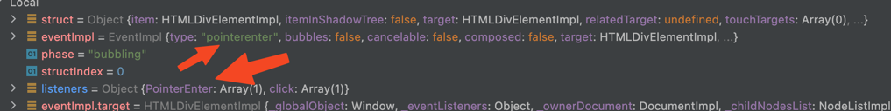

Sample repo that shows a problem where `fireEvent.pointerEnter` does not work for a preact component.

To reproduce 

```
yarn install
yarn test
```

The following does not work

```typescript
interface TestComponentProps {
    onPointerEnter: () => void
    onClick: () => void
}
export const TestComponent : FunctionComponent<TestComponentProps> = ({onPointerEnter, onClick}) => {
    return <div onPointerEnter={onPointerEnter} onClick={onClick} data-testid="test-div">My Div</div>
}
```

and the corresponding test
```typescript

interface TestComponentProps {
    onPointerEnter: () => void
    onClick: () => void
}
export const TestComponent : FunctionComponent<TestComponentProps> = ({onPointerEnter, onClick}) => {
    return <div onPointerEnter={onPointerEnter} onClick={onClick} data-testid="test-div">My Div</div>
}
```

The problem appears that the listeners in jsdom are registered with `PointerEnter` while the event being fired is `pointerenter`.

Screenshot of the listeners in jsdoms `EventTarget-impl.js` `invokeEventListeners`

